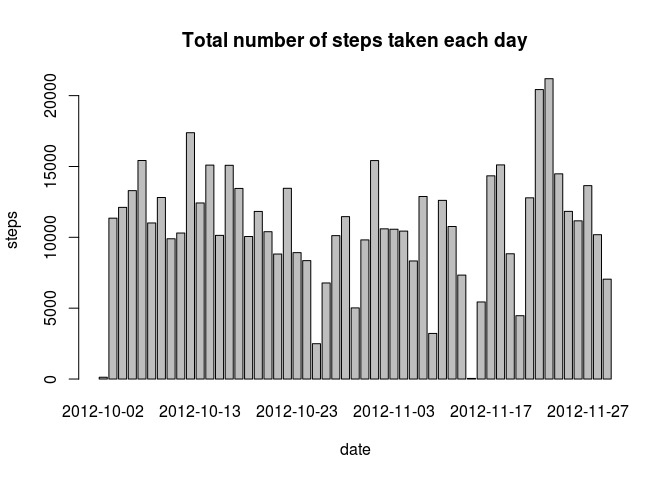
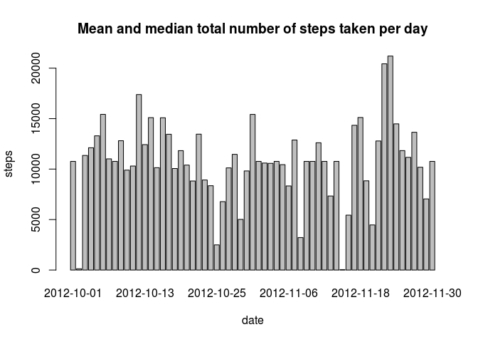

# Reproducible Research: Peer Assessment 1


## Loading and preprocessing the data
Load the data:

```r
unzip("activity.zip")
activity<-read.csv("activity.csv")
```

##What is mean total number of steps taken per day?
I'm going to ignore the missing values in the dataset.

1.Make a histogram of the total number of steps taken each day

```r
steps.date<-aggregate(steps~date,data=activity, FUN=sum)
barplot(steps.date$steps, names.arg=steps.date$date, xlab="date", ylab="steps", main="Total number of steps taken each day")
```

 

2.Calculate and report the *mean* and *median* total number of steps taken per day

```r
mean(steps.date$steps)
```

```
## [1] 10766.19
```

```r
median(steps.date$steps)
```

```
## [1] 10765
```

##What is the average daily activity pattern?
1.Make a time series plot (i.e. type = "l") of the 5-minute interval (x-axis) and the average number of steps taken, averaged across all days (y-axis)

```r
steps.interval<-aggregate(steps~interval,data=activity, FUN=mean)
plot(steps.interval, main="Average daily activity pattern", type="l")
```

 

2.Which 5-minute interval, on average across all the days in the dataset, contains the maximum number of steps?

```r
steps.interval$interval[which.max(steps.interval$steps)]
```

```
## [1] 835
```

##Imputing missing values

1.Calculate and report the total number of missing values in the dataset (i.e. the total number of rows with NAs)

```r
sum(is.na(activity))
```

```
## [1] 2304
```

2.Devise a strategy for filling in all of the missing values in the dataset.

I'm going to use the mean for the 5-minute intervals.

3.Create a new dataset that is equal to the original dataset but with the missing data filled in.

```r
activity<-merge(activity, steps.interval, by="interval", suffixes=c("", ".y"))
nas<-is.na(activity$steps)
activity$steps[nas]<-activity$steps.y[nas]
activity<-activity[,c(1:3)]
```

4.Make a histogram of the total number of steps taken each day and Calculate and report the mean and median total number of steps taken per day. Do these values differ from the estimates from the first part of the assignment? What is the impact of imputing missing data on the estimates of the total daily number of steps?

```r
steps.date<-aggregate(steps~date, data=activity, FUN=sum)
barplot(steps.date$steps, names.arg=steps.date$date, xlab="date", ylab="steps", main="Mean and median total number of steps taken per day")
```

 

```r
mean(steps.date$steps)
```

```
## [1] 10766.19
```

```r
median(steps.date$steps)
```

```
## [1] 10766.19
```

There's no significant diferences between mean and median values for the two sets of data.

##Are there differences in activity patterns between weekdays and weekends?

Using the weekdays() function. Note that for language compatibility, I include "sábado" and "domingo" in "weekends" (i.e. not "weekdays"), which are saturday and sunday in spanish.

1.Create a new factor variable in the dataset with two levels "weekdays" and "weekends" indicating whether a given date is a weekday or weekend day.

```r
daytype <- function(date) {
  if (weekdays(as.Date(date)) %in% c("domingo", "sunday", "sábado", "saturday")) {
    "weekend"
  } else {
    "weekday"
  }
}
activity$daytype <- as.factor(sapply(activity$date, daytype))
```

2.Make a panel plot containing a time series plot (i.e. type = "l") of the 5-minute interval (x-axis) and the average number of steps taken, averaged across all weekday days or weekend days (y-axis).

```r
par(mfrow=c(2, 1))
for (type in c("weekend", "weekday")) {
  steps.type<-aggregate(steps~interval, data=activity, subset=activity$daytype==type, FUN=mean)
  plot(steps.type, type="l", main=type)
}
```

 

That's it!
